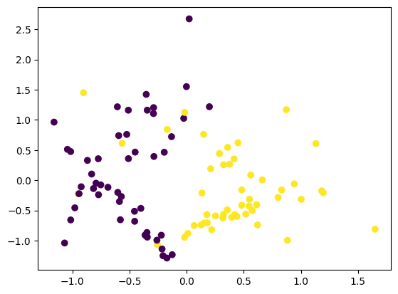
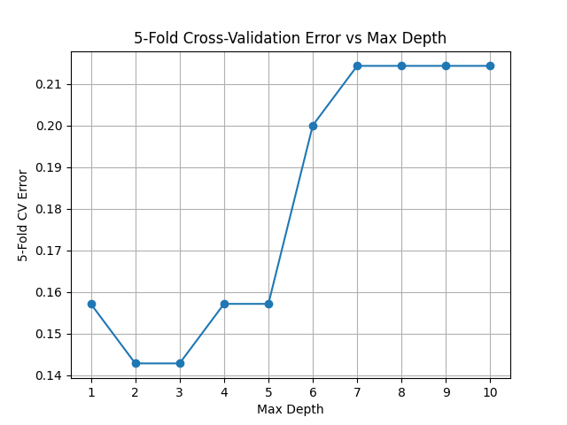
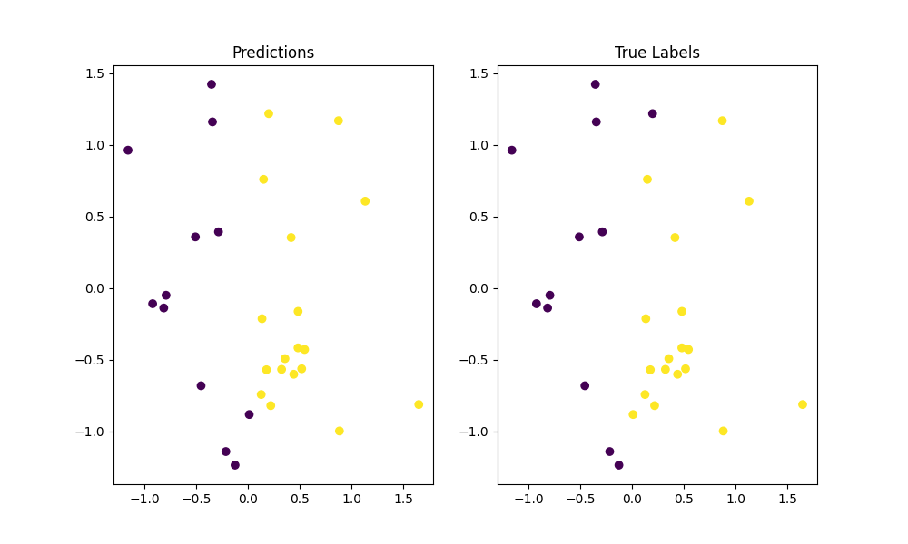

# Decision Tree Implementation - Question 2

## Performance on generated dataset
Generated the dataset using the following code:

```python
from sklearn.datasets import make_classification
X, y = make_classification(
    n_features=2, n_redundant=0, n_informative=2, random_state=1, n_clusters_per_class=2, class_sep=0.5)

# For plotting
import matplotlib.pyplot as plt
plt.scatter(X[:, 0], X[:, 1], c=y)
```

### Results

- The dataset was split into 70% training and 30% testing.
```python
data = pd.DataFrame(X, columns=['f1', 'f2'])
Y= pd.Series(y)
X_train, X_test = data.iloc[:70], data.iloc[70:].reset_index(drop=True)
print(X_train.shape, X_test.shape)
y_train, y_test = Y.iloc[:70], Y.iloc[70:].reset_index(drop=True)
print(y_train.shape,y_test.shape)
```
```text
(70, 2) (30, 2)
```
- Custom Decision model was trained on X
```python
dt = DecisionTree(criterion='gini_index', max_depth=5)
dt.fit(X_train, y_train)
dt.plot()
```
```
Decision Tree with criterion: gini_index  and max_depth: 5 .

Root: ?(f1 <= 0.043777523046321265) | IG: 0.3274 | Samples: 70
    ├── Y: ?(f1 <= -0.17186200022530262) | IG: 0.0275 | Samples: 45       
    |   ├── Y: ?(f2 <= 1.3334978201484127) | IG: 0.0433 | Samples: 38     
    |   |   ├── Y: ?(f2 <= -1.0534230074515962) | IG: 0.0112 | Samples: 37
    |   |   |   ├── Y: ?(f1 <= -0.23210583396758255) | IG: 0.4444 | Samples: 3
    |   |   |   |   ├── Y: Leaf | Value: 1 | Samples: 1
    |   |   |   |   └── N: Leaf | Value: 0 | Samples: 2
    |   |   |   └── N: ?(f2 <= -0.2335452640026076) | IG: 0.0055 | Samples: 34
    |   |   |       ├── Y: Leaf | Value: 0 | Samples: 15
    |   |   |       └── N: Leaf | Value: 0 | Samples: 19
    |   |   └── N: Leaf | Value: 1 | Samples: 1
    |   └── N: ?(f1 <= -0.009944371488954856) | IG: 0.1469 | Samples: 7
    |       ├── Y: ?(f1 <= -0.02217129486290728) | IG: 0.2133 | Samples: 5
    |       |   ├── Y: ?(f1 <= -0.15154643493571088) | IG: 0.4444 | Samples: 3
    |       |   |   ├── Y: Leaf | Value: 1 | Samples: 1
    |       |   |   └── N: Leaf | Value: 0 | Samples: 2
    |       |   └── N: Leaf | Value: 1 | Samples: 2
    |       └── N: Leaf | Value: 0 | Samples: 2
    └── N: Leaf | Value: 1 | Samples: 25
```

- Accuracy, per-class precision, and recall were calculated using the implemented decision tree.
```python
# a) accuracy and per class precision, recall 
predictions = dt.predict(X_test)
print("Accuracy:", accuracy(pd.Series(predictions), y_test))
print("Precision for class 0:", precision(pd.Series(predictions), y_test, 0))
print("Precision for class 1:", precision(pd.Series(predictions), y_test, 1))
print("Recall for class 0:", recall(pd.Series(predictions), y_test, 0))
print("Recall for class 1:", recall(pd.Series(predictions), y_test, 1))

```
```
Accuracy: 0.9
Precision for class 0: 0.9090909090909091
Precision for class 1: 0.8947368421052632
Recall for class 0: 0.8333333333333334
Recall for class 1: 0.9444444444444444
```
- Performed Nested 5 fold cross validaton
```python
depths = list(range(1, 11))
cv_errors = []
for depth in depths:
    fold_errors = []
    fold_size = len(X_train) // 5
    for i in range(5):
        X_val = X_train.iloc[i*fold_size:(i+1)*fold_size].reset_index(drop=True)
        y_val = y_train.iloc[i*fold_size:(i+1)*fold_size].reset_index(drop=True)
        X_tr = pd.concat([X_train.iloc[:i*fold_size], X_train.iloc[(i+1)*fold_size:]]).reset_index(drop=True)
        y_tr = pd.concat([y_train.iloc[:i*fold_size], y_train.iloc[(i+1)*fold_size:]]).reset_index(drop=True)
        
        model = DecisionTree(criterion='gini_index', max_depth=depth)
        model.fit(X_tr, y_tr)
        val_predictions = model.predict(X_val)
        fold_errors.append(1 - accuracy(pd.Series(val_predictions), y_val))
    cv_errors.append(np.mean(fold_errors))

plt.plot(depths, cv_errors, marker='o')
plt.xlabel('Max Depth')
plt.ylabel('5-Fold CV Error')
plt.title('5-Fold Cross-Validation Error vs Max Depth')
plt.xticks(depths)
plt.grid()
```

``` text
Optimal max_depth: 2
Training Error: 0.09999999999999998
Test Error: 0.06666666666666665
Test Accuracy: 0.93333
Test Precision for class 0: 0.91667
Test Precision for class 1: 0.94444
Test Recall for class 0: 0.91667
Test Recall for class 1: 0.94444
```
