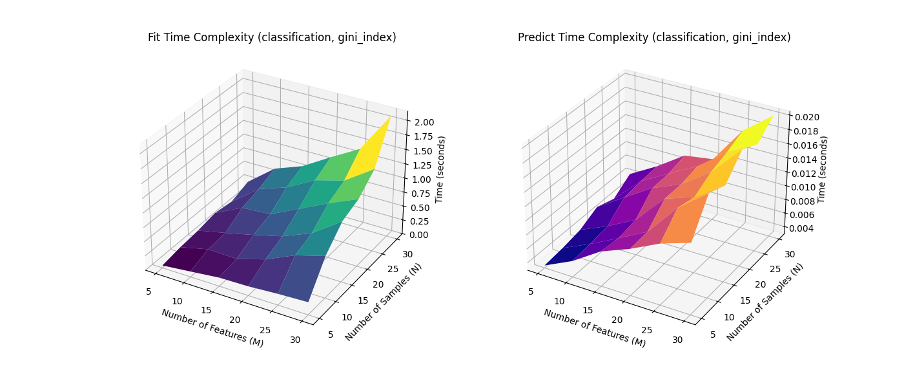
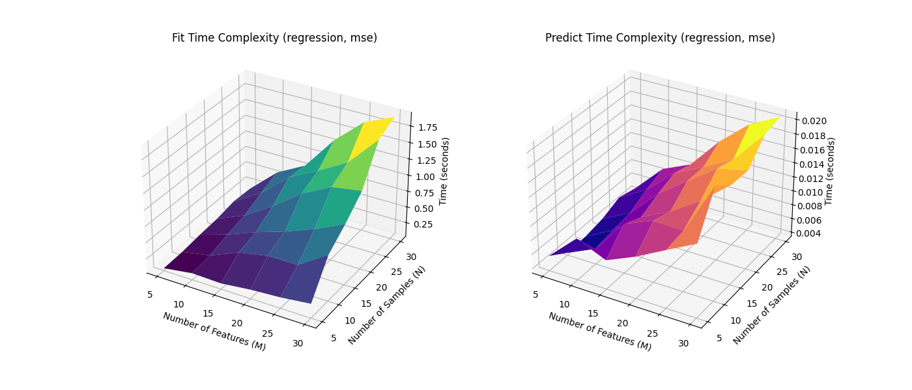
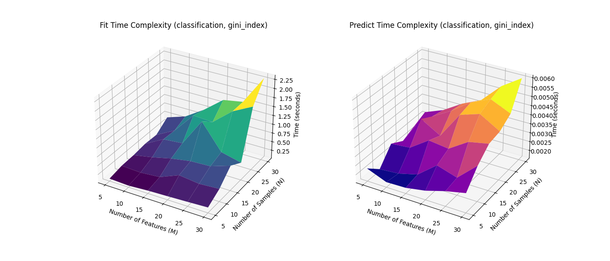
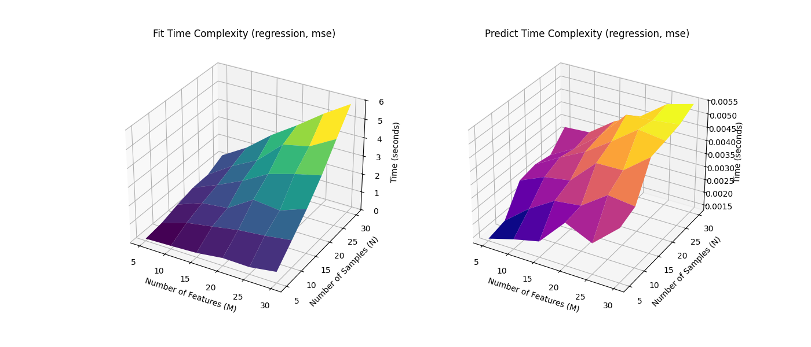

# Decision Tree Implementation - Question 4

## Experiments on the run time complexity of training and testing the decision tree model
The time complexity of training a decision tree model is O(N * M * log N), where N is the number of training samples and M is the number of features. The time complexity of making predictions (testing) with a trained decision tree model is O(M) per sample, as it involves traversing the tree from the root to a leaf node based on the feature values.

1.Create a dataset with Discrete Input and Discrete Output using create_fake_dataset_function in experiments.py file.
   - Varying N (number of samples) with fixed M (number of features)
   - Varying M (number of features) with fixed N (number of samples)
```python
def create_fake_data(N: int, M: int, task: str, percent_real=0.5) -> tuple[pd.DataFrame, pd.Series]:
    """
    Function to create fake data with N samples and M binary features
    task: 'classification' or 'regression'
    """
    if task not in ['classification', 'regression']:
        raise ValueError("task must be 'classification' or 'regression'")
    # add half real and half discrete features
    X_real = pd.DataFrame(np.random.randn(N, int(M*percent_real)), columns=[f'real_{i}' for i in range(int(M*percent_real))])
    X_bin = pd.DataFrame(np.random.randint(0, 2, size=(N, M - int(M*percent_real))), columns=[f'bin_{i}' for i in range(M - int(M*percent_real))])
    X = pd.concat([X_real, X_bin], axis=1)
    if task == 'classification':
        y = pd.Series(np.random.randint(0, 2, size=N), name='target')
    else:
        y = pd.Series(np.random.rand(N), name='target')
    return X, y
```
# Function to calculate average time (and std) taken by fit() and predict() for different N and P for 4 different cases of DTs
```python
def calculate_time_complexity(N_values: list[int], M_values: list[int], task: str, criterion: str, percent_real=0.5) -> tuple[np.ndarray, np.ndarray, np.ndarray, np.ndarray]:
    fit_times = np.zeros((len(N_values), len(M_values)))
    predict_times = np.zeros((len(N_values), len(M_values)))
    fit_std = np.zeros((len(N_values), len(M_values)))
    predict_std = np.zeros((len(N_values), len(M_values)))

    for i, N in enumerate(N_values):
        for j, M in enumerate(M_values):
            X, y = create_fake_data(N, M, task, percent_real)
            dt = DecisionTree(criterion=criterion, max_depth=5)

            fit_time_list = []
            predict_time_list = []

            for _ in tqdm(range(num_average_time), desc=f"Averaging runs ({task}, {criterion})", leave=False):
                start_time = time.time()
                dt.fit(X, y)
                fit_time_list.append(time.time() - start_time)

                start_time = time.time()
                dt.predict(X)
                predict_time_list.append(time.time() - start_time)

            fit_times[i, j] = np.mean(fit_time_list)
            predict_times[i, j] = np.mean(predict_time_list)

    return fit_times, predict_times
```

# Function to plot the results
```python
def plot_time_complexity(N_values: list[int], M_values: list[int], fit_times: np.ndarray, predict_times: np.ndarray,  task: str, criterion: str):
    N_grid, M_grid = np.meshgrid(M_values, N_values)

    fig = plt.figure(figsize=(14, 6))

    ax1 = fig.add_subplot(121, projection='3d')
    print(fit_times)
    ax1.plot_surface(N_grid, M_grid, fit_times, cmap='viridis', edgecolor='none')
    ax1.set_title(f'Fit Time Complexity ({task}, {criterion})')
    ax1.set_xlabel('Number of Features (M)')
    ax1.set_ylabel('Number of Samples (N)')
    ax1.set_zlabel('Time (seconds)')

    ax2 = fig.add_subplot(122, projection='3d')
    ax2.plot_surface(N_grid, M_grid, predict_times, cmap='plasma', edgecolor='none')
    ax2.set_title(f'Predict Time Complexity ({task}, {criterion})')
    ax2.set_xlabel('Number of Features (M)')
    ax2.set_ylabel('Number of Samples (N)')
    ax2.set_zlabel('Time (seconds)')

    plt.tight_layout()
    plt.show()
```
## Running the experiments for all four cases of decision trees
```python
N_values = [5,10,15,20,25,30]
M_values = [5,10,15,20,25,30]
def run_experiments(task: str, percent_real=0.5):
    if task == 'classification':
        criterion = 'gini_index'
    else:
        criterion = 'mse'
    fit_times, predict_times = calculate_time_complexity(N_values, M_values, task, criterion,percent_real=percent_real)
    plot_time_complexity(N_values, M_values, fit_times, predict_times, task, criterion)
```

1.**Discrete Input and Discrete Output**

```python
# Discrete input Discrete output
run_experiments('classification',0.0)

```
```text
fit_time
no._ftr_5	no._ftr_10	no._ftr_15	no._ftr_20	no._ftr_25	no._ftr_30
5	0.039642	0.092883	0.148559	0.159352	0.193642	0.216693
10	0.094675	0.212462	0.198643	0.350809	0.581216	0.729242
15	0.126667	0.237247	0.355178	0.485737	0.695352	1.052609
20	0.186528	0.430933	0.463811	0.708640	0.953514	1.174476
25	0.140717	0.515600	0.690788	0.961773	1.097929	1.440094
30	0.255415	0.640913	0.826814	1.126511	1.410211	2.113245

predict_time
	no._ftr_5	no._ftr_10	no._ftr_15	no._ftr_20	no._ftr_25	no._ftr_30
5	0.003279	0.005223	0.007897	0.009549	0.011564	0.012937
10	0.003585	0.005471	0.007572	0.009752	0.014310	0.017487
15	0.004088	0.005883	0.008058	0.012261	0.013684	0.016483
20	0.005374	0.007977	0.010534	0.012257	0.015140	0.019361
25	0.004510	0.008327	0.010611	0.012800	0.015945	0.018163
30	0.006231	0.008535	0.011266	0.011861	0.017056	0.020204

```


2.**Discrete Input and Real Output**

```python
# Discrete input Real output
run_experiments('regression',0.0)
```
```text
fit_time
	no._ftr_5	no._ftr_10	no._ftr_15	no._ftr_20	no._ftr_25	no._ftr_30
5	0.069783	0.135103	0.120825	0.170971	0.199851	0.251242
10	0.082041	0.168105	0.354309	0.442420	0.446288	0.742619
15	0.117994	0.260854	0.432636	0.578529	0.754563	0.967261
20	0.141862	0.329986	0.608745	0.936845	1.164797	1.234583
25	0.195902	0.461603	0.839607	1.068242	1.319056	1.784731
30	0.181172	0.572473	0.807783	1.326508	1.721396	1.917385

predict_time
	no._ftr_5	no._ftr_10	no._ftr_15	no._ftr_20	no._ftr_25	no._ftr_30
5	0.005508	0.009240	0.007483	0.009277	0.011464	0.013607
10	0.003745	0.005606	0.010368	0.012045	0.011910	0.019126
15	0.003910	0.006106	0.009229	0.011237	0.013890	0.017287
20	0.004424	0.006471	0.010471	0.013411	0.016306	0.017170
25	0.005500	0.007817	0.011399	0.013405	0.015576	0.020028
30	0.004852	0.008848	0.010661	0.015083	0.018550	0.020620

```


3.**Real Input and Discrete Output**

```python
# Real input Discrete output
run_experiments('classification',1.0)
```
```text
fit_time
	no._ftr_5	no._ftr_10	no._ftr_15	no._ftr_20	no._ftr_25	no._ftr_30
5	0.056555	0.058284	0.096580	0.119621	0.148327	0.170677
10	0.166625	0.138956	0.185405	0.415972	0.381421	0.362524
15	0.228448	0.327211	0.369080	0.678194	0.675132	0.932234
20	0.297834	0.468672	0.682386	1.313349	0.623367	0.639757
25	0.210741	0.595919	1.177584	1.129569	1.556251	2.104612
30	0.549819	0.777067	1.225828	1.588358	1.703262	2.373620

predict_time
	no._ftr_5	no._ftr_10	no._ftr_15	no._ftr_20	no._ftr_25	no._ftr_30
5	0.001432	0.001638	0.001918	0.002181	0.002428	0.002737
10	0.001613	0.001810	0.002040	0.002959	0.002905	0.003243
15	0.002928	0.003000	0.003095	0.004247	0.004948	0.005276
20	0.002756	0.003039	0.003769	0.004583	0.004696	0.005295
25	0.002366	0.003629	0.005404	0.005050	0.004841	0.006109
30	0.003091	0.003828	0.004330	0.005219	0.005842	0.006584

```



4.**Real Input and Real Output**

```python
# Real input Real output
run_experiments('regression',1.0)
```

```text
fit_time
	no._ftr_5	no._ftr_10	no._ftr_15	no._ftr_20	no._ftr_25	no._ftr_30
5	0.082609	0.134668	0.200541	0.383860	0.354873	0.567980
10	0.203236	0.642774	0.876994	1.131334	1.269584	1.472373
15	0.483465	0.994127	1.145385	2.036570	1.875639	2.400275
20	0.708556	1.283378	1.927923	2.715476	3.122817	3.459069
25	0.740803	1.645968	2.364028	3.631601	3.921520	4.703843
30	1.166310	1.998026	3.097652	4.017648	5.018829	5.904692

predict_time
	no._ftr_5	no._ftr_10	no._ftr_15	no._ftr_20	no._ftr_25	no._ftr_30
5	0.001372	0.001662	0.001895	0.002917	0.002460	0.003340
10	0.001535	0.002309	0.002907	0.003026	0.003714	0.003594
15	0.002597	0.003018	0.003175	0.004110	0.004123	0.004889
20	0.002731	0.003284	0.003775	0.004434	0.005142	0.005000
25	0.002618	0.003153	0.003923	0.004965	0.005024	0.005133
30	0.003259	0.003316	0.004010	0.004455	0.005172	0.005435
```



### Conclusions:
- Training time increases with both the number of samples (N) and the number of features (M), consistent with the O(N * M * log N) complexity.
- Prediction time increases linearly with the number of features (M), consistent with the O(M) complexity per sample.
- One can observe that for real inputs training time is much higher for regression tasks, due to the complexity of calculating mse and finding optimal splits in continuous space which have chosen to be mid points between each sample in sorted order.
